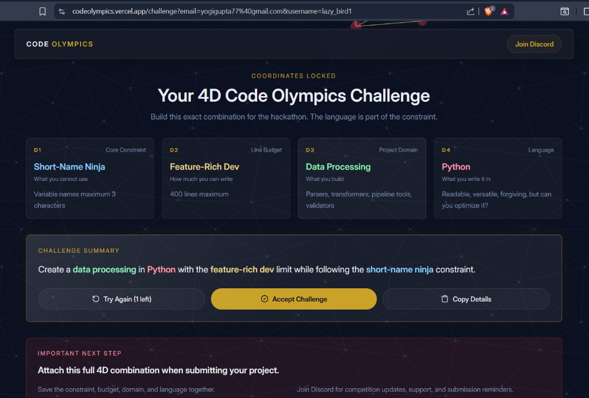
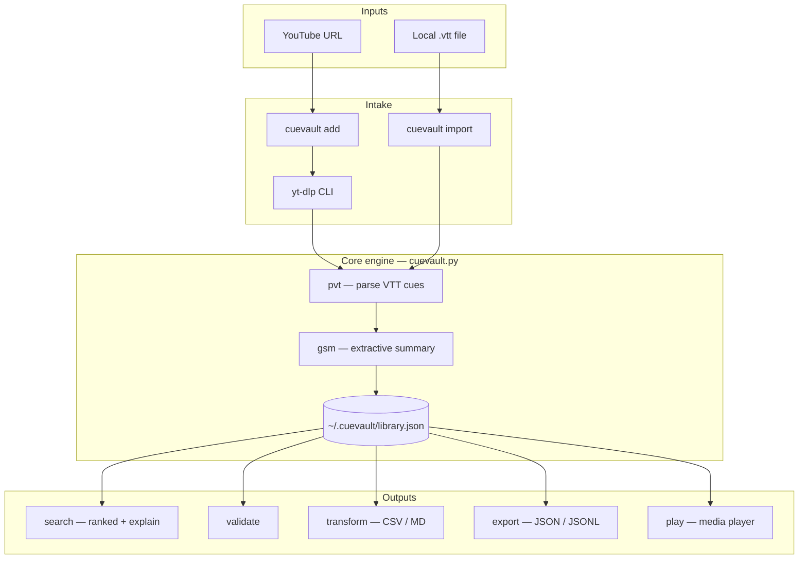
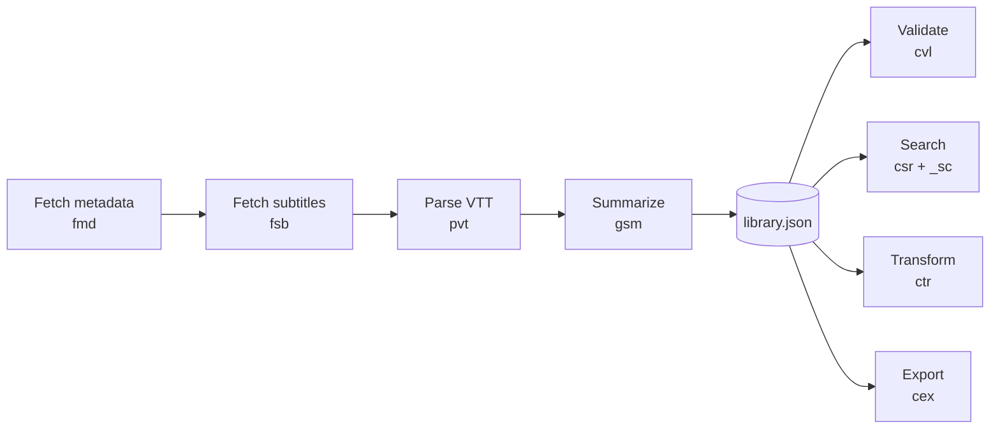
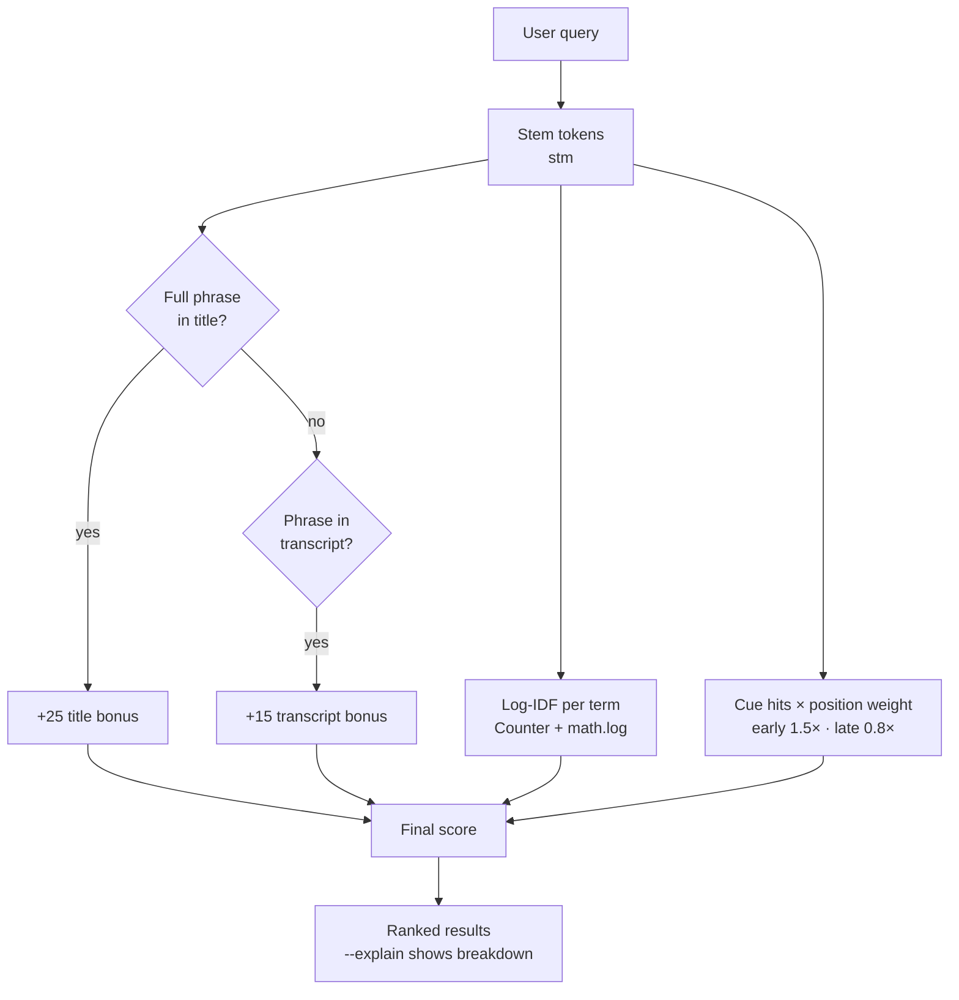
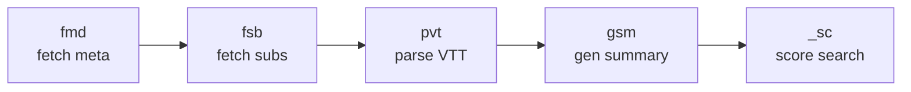

# CueVault — Code Olympics 2026 Submission

<p align="center">
  
</p>

<p align="center">
  <em>Official 4D combination — attach this constraint set with your submission.</em>
</p>

**YouTube transcript data pipeline:** parse → transform → validate → export → search.

Turn video subtitles into a **searchable personal knowledge base** — fetch from YouTube or import local `.vtt` files, then query across your whole library with ranked, explainable results.

> **Challenge summary:** Build a **data processing** tool in **Python** with the **Feature-Rich Dev** line budget while following the **Short-Name Ninja** constraint.

---

## For judges (60-second demo)

```powershell
pip install -r requirements.txt
python scripts/verify_constraints.py
powershell -ExecutionPolicy Bypass -File demo/run_demo.ps1
python cuevault.py search "machine learning" --explain
```

No network required for the demo script. See [SUBMISSION.md](SUBMISSION.md) for the checklist and video script.

**Visual showcase:** open [index.html](index.html) in a browser.

---

## 4D challenge constraints

| Dimension | Assignment | Rule | CueVault compliance |
|-----------|------------|------|---------------------|
| **D1 — Core** | Short-Name Ninja | Variable names ≤ 3 characters | Verified: `python scripts/verify_constraints.py` |
| **D2 — Line budget** | Feature-Rich Dev | 400 lines maximum | **391 / 400** lines in `cuevault.py` |
| **D3 — Domain** | Data Processing | Parsers, transformers, pipelines, validators | Full pipeline: parse → transform → validate → export → search |
| **D4 — Language** | Python | Assigned language | Stdlib only; `yt-dlp` via `subprocess` (not imported) |

---

## System architecture



---

## Data pipeline (processing stages)



| Stage | Function | Input → Output |
|-------|----------|----------------|
| Parse | `pvt` | `.vtt` file → `cues[]` with timestamps |
| Transform | `gsm` | cues → extractive summary string |
| Validate | `cvl` | library → pass/fail report |
| Query | `_sc` / `csr` | query + library → ranked videos + snippets |
| Export | `ctr` / `cex` | library → CSV, Markdown, JSONL |

---

## Search scoring (innovation)



Run: `python cuevault.py search "machine learning" --explain`

---

## Cross-constraint combo (+5 bonus)

**Short-Name Ninja + Data Processing** produced an emergent **pipeline vocabulary** — function names encode their stage:



| Name | Meaning |
|------|---------|
| `pvt` | **P**arse **VT**T |
| `gsm` | **G**enerate **S**u**m**mary |
| `fmd` / `fsb` | **F**etch metadata / **s**u**b**titles |
| `stm` | **S**tem tokens |
| `_sc` | **Sc**ore search match |
| `cim` / `cpl` | Command **im**port / **pl**ay |

The naming limit did not just shorten code — it created a navigable verb chain judges can follow in 391 lines.

---

## Commands

| Command | Role |
|---------|------|
| `add <url>` | Fetch metadata + subtitles (needs `yt-dlp` + network) |
| `import <file.vtt>` | Offline VTT intake |
| `search <terms> [--explain]` | Ranked full-text search |
| `validate` | Schema + transcript checks |
| `transform <id> <out> --fmt csv\|md` | Export one transcript |
| `export <out> --format json\|jsonl` | Dump library |
| `info <id> [--cues]` | Metadata + cue preview |
| `stats` | Library analytics |
| `update <id> [--subs]` | Refresh from YouTube |
| `remove <id>` | Delete record |
| `list` | Browse library |
| `play <id>` | Open in mpv / vlc / ffplay |

```bash
python cuevault.py          # help
python cuevault.py list
```

---

## Local setup

**Requirements:** Python 3.10+, [yt-dlp](https://github.com/yt-dlp/yt-dlp) (for `add` only)

```bash
git clone <your-repo-url>
cd CueVault
pip install -r requirements.txt
```

### Offline demo (no network)

```powershell
powershell -ExecutionPolicy Bypass -File demo/run_demo.ps1
```

### Live YouTube workflow

```bash
python cuevault.py add "https://www.youtube.com/watch?v=VIDEO_ID"
python cuevault.py search "your topic" --explain
python cuevault.py transform VIDEO_ID notes.md --fmt md
python cuevault.py export backup.jsonl --format jsonl
```

### Quality checks

```powershell
powershell -ExecutionPolicy Bypass -File scripts/lint.ps1
python -m unittest tests.test_offline -v
```

---

## Language love letter (+3 bonus)

Python's stdlib made a **12-command data pipeline** fit under 400 lines:

| Need | Stdlib tool |
|------|-------------|
| Term frequencies | `collections.Counter` |
| IDF weighting | `math.log` |
| Paths / atomic save | `pathlib.Path` + temp file `replace()` |
| CLI surface | `argparse` subparsers |
| External tool | `subprocess` + `shutil.which` for yt-dlp **without importing it** |

The extractive summarizer (`gsm`) uses nested scoring in ~20 lines — shorter than wiring NLTK would be after import overhead. The real stretch was **density under Short-Name Ninja**, not Python syntax.

---

## Honest self-assessment (required)

Python is our assigned language and primary comfort zone — **language unfamiliarity does not show in crashes or syntax**. What *does* show:

1. **Readability vs line budget** — every identifier is ≤3 characters; use the decoder table above.
2. **Heuristic stemming** — no NLTK; `learning`→`learn` works, irregular verbs do not.
3. **Extractive summaries** — high-TF sentence picking, not LLM-quality abstracts.
4. **The hard constraint was Short-Name + 400 lines**, documented in the pipeline vocabulary.

---

## Project layout

```
assets/constraints.png     # Official 4D challenge screenshot (for judges)
cuevault.py                # Submission (391 lines, Python stdlib)
requirements.txt           # yt-dlp (CLI dependency)
index.html                 # Browser showcase for judges
demo/
  run_demo.ps1             # One-command offline walkthrough
  sample_library.json      # Demo data
  sample.vtt               # Import example
scripts/
  verify_constraints.py    # 4D compliance checker
  lint.ps1                 # pylint + compile
tests/
  test_offline.py          # No-network tests
docs/
  VIDEO_SCRIPT.md          # Recording guide
SUBMISSION.md              # Judge checklist
```

---

## Data storage

| Path | Purpose |
|------|---------|
| `~/.cuevault/library.json` | Video library |
| `~/.cuevault/cache/` | Cached `.vtt` files |

Legacy `~/.pilyt/` is auto-migrated on first run if present.

---

## Real-world use cases

- **Students** — searchable notes from lecture transcripts  
- **Creators** — grep every video for a phrase across your catalog  
- **Researchers** — export CSV/JSONL for qualitative analysis  

---

## License & attribution

Built for [Code Olympics 2026](https://raptors.dev) · Hackathon Raptors.  
Submit: public repo URL + video walkthrough — see [SUBMISSION.md](SUBMISSION.md).
